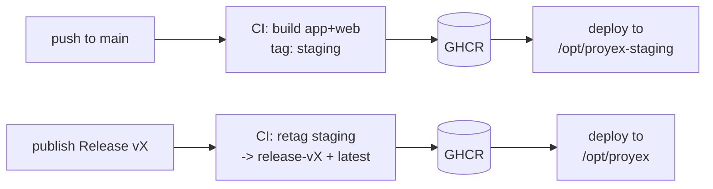

# Proyex Deployment

Proyex deploys as two Docker images — `app` (PHP-FPM + application code) and
`web` (nginx + compiled assets) — built once in CI, published to GHCR, and run
on a DigitalOcean droplet that holds **only** the compose files and an `.env`.
There is no source code, no build, and no repo clone on the server.

## TL;DR (after one-time setup)

Deployment runs in **two lanes**:

```bash
# STAGING — automatic on every push to main.
git push origin main
# -> CI builds `app` + `web` images tagged `staging`, deploys to the staging server.

# PRODUCTION — deliberate, once staging looks good.
# Publish a GitHub Release (e.g. v1.2.0) from the commit currently on staging.
# -> CI PROMOTES the validated `staging` images to `release-v1.2.0` (+ `latest`),
#    deploys to the production server. No rebuild — the exact tested artifact ships.
```

No SSH and no manual server commands in the normal flow — GitHub Actions handles it.

## Architecture



- **Staging lane** ([.github/workflows/build-and-deploy.yml](.github/workflows/build-and-deploy.yml)):
  every push to `main` builds and pushes both images tagged `staging`, copies the
  compose files to the staging server (`/opt/proyex-staging`), pulls, and runs them.
- **Production lane** ([.github/workflows/deploy-on-release.yml](.github/workflows/deploy-on-release.yml)):
  publishing a Release **re-tags the existing `staging` image by digest** to
  `release-<version>` and `latest` (via `docker buildx imagetools create` — no
  rebuild), then deploys to the production server (`/opt/proyex`).
- **CI gates** on every PR/push: [tests.yml](.github/workflows/tests.yml),
  [lint.yml](.github/workflows/lint.yml), and [docker-build.yml](.github/workflows/docker-build.yml)
  (validates both images actually build before anything can be deployed).
- **Droplet(s)**: hold only the compose files (copied by CI) and a local `.env`.
  Containers run by pulling pre-built images from GHCR.

> **Build once, promote.** Production never rebuilds from source. The image you
> verified on staging is the identical image (same digest) that ships to prod.
> This is why rollback is just selecting an older `release-*` tag.

## Why a single image build, two image targets

Both images are produced from one [docker/php/Dockerfile](docker/php/Dockerfile):

- A single `frontend_build` stage runs `npm run build`. The Laravel Wayfinder
  Vite plugin shells out to `php artisan`, so this stage has **both** PHP and Node.
- The `prod` target (app) and the `web` target (nginx) both `COPY --from` that
  one stage, so the compiled assets in `web` are identical to what `app` ships.
- The runtime images stay lean: no Node, npm, or Xdebug in `prod`/`web`.

The document root lives at the same absolute path (`/var/www/html/public`) in
both the `app` and `web` containers, so nginx's `SCRIPT_FILENAME` points at a
path php-fpm can open. See [docker/nginx/default.conf](docker/nginx/default.conf).

## Prerequisites

- DigitalOcean droplet(s), Ubuntu 22.04 LTS (one for staging, one for production —
  see the single-droplet note below).
- A domain with DNS A record pointing at the production droplet IP.
- GitHub repository with push access.
- An SSH key pair per server for CI deploys.

> **Single droplet?** The base compose uses fixed container names and the prod
> overlay publishes port `80`. Running staging **and** production on one droplet
> would collide on both. Use **separate droplets**, or give the staging stack a
> distinct compose project name and ports (not covered here). Separate droplets
> is the supported path.

## One-time setup

### 1. Create a deploy SSH key (per server)

On your local machine:
```bash
ssh-keygen -t ed25519 -f ~/.ssh/proyex_deploy -C "github-actions-deploy" -N ""
ssh-copy-id -i ~/.ssh/proyex_deploy.pub root@YOUR_DROPLET_IP
```

### 2. Add GitHub Actions secrets

Repo → Settings → Secrets and variables → Actions. Add one set per environment:

| Secret | Value |
|--------|-------|
| `STAGING_DEPLOY_KEY` | Private key for the staging server |
| `STAGING_DEPLOY_HOST` | Staging droplet IP or hostname |
| `STAGING_DEPLOY_USER` | SSH user (e.g. `root`) |
| `PROD_DEPLOY_KEY` | Private key for the production server |
| `PROD_DEPLOY_HOST` | Production droplet IP or hostname |
| `PROD_DEPLOY_USER` | SSH user (e.g. `root`) |

`GITHUB_TOKEN` (used to push/promote images in GHCR) is provided automatically.

### 3. Prepare the droplet

```bash
ssh root@YOUR_DROPLET_IP
apt update && apt upgrade -y
curl -fsSL https://get.docker.com | sh
```

Create the deploy directory (no repo clone — CI copies the compose files in on
every deploy; the app code ships inside the images):
```bash
# production: /opt/proyex   |   staging: /opt/proyex-staging
mkdir -p /opt/proyex && cd /opt/proyex
```

Create the `.env` (this file is the only thing you maintain by hand on the server):
```dotenv
APP_ENV=production
APP_DEBUG=false
APP_URL=https://yourdomain.com

# Always target the production compose stack on this server, so plain
# `docker compose ...` (no -f flags) works for every command.
COMPOSE_FILE=docker-compose.yml:docker-compose.prod.yml

# Pin the deployed image. CI deploys a specific release-<version>; pinning here
# means a host reboot re-pulls the SAME version, not a moving `latest`.
IMAGE_TAG=release-v1.0.0

DB_HOST=db
DB_PORT=3306
DB_DATABASE=proyex_prod
DB_USERNAME=proyex_prod
DB_PASSWORD=CHANGE_ME_strong
DB_ROOT_PASSWORD=CHANGE_ME_strong_root

REDIS_HOST=redis
REDIS_PORT=6379

SESSION_DRIVER=database
CACHE_STORE=database
QUEUE_CONNECTION=database
```
```bash
chmod 600 .env
```

> On the **staging** server use `/opt/proyex-staging`, `IMAGE_TAG=staging`, and a
> separate database name/credentials.

### 4. TLS termination (production)

The `web` container publishes plain HTTP on port `80`. Terminate TLS with a host
reverse proxy in front of it — do **not** point nginx at `/opt/proyex/public`
(there is no source on the server; the assets live inside the `web` container).

```bash
apt install nginx certbot python3-certbot-nginx -y
nano /etc/nginx/sites-available/proyex
```
```nginx
server {
    listen 80;
    server_name yourdomain.com www.yourdomain.com;
    return 301 https://$host$request_uri;
}

server {
    listen 443 ssl http2;
    server_name yourdomain.com www.yourdomain.com;

    ssl_certificate     /etc/letsencrypt/live/yourdomain.com/fullchain.pem;
    ssl_certificate_key /etc/letsencrypt/live/yourdomain.com/privkey.pem;
    ssl_protocols TLSv1.2 TLSv1.3;

    client_max_body_size 100M;

    # Proxy to the containerized web (nginx) service published on the host.
    location / {
        proxy_pass http://127.0.0.1:80;
        proxy_set_header Host              $host;
        proxy_set_header X-Real-IP         $remote_addr;
        proxy_set_header X-Forwarded-For   $proxy_add_x_forwarded_for;
        proxy_set_header X-Forwarded-Proto $scheme;
    }
}
```

> Because the host proxy listens on `443` and the container on `80`, there is no
> port clash. If you prefer, move TLS into the `web` container instead and skip
> the host nginx — but use one approach, not both.

```bash
ln -s /etc/nginx/sites-available/proyex /etc/nginx/sites-enabled/
nginx -t && systemctl restart nginx
certbot --nginx -d yourdomain.com -d www.yourdomain.com
```

### 5. First deploy

Trigger the staging lane (`git push origin main`) or the production lane (publish
a Release). To bring a server up manually the first time:
```bash
cd /opt/proyex
docker compose pull
docker compose up -d --wait      # waits for db/redis healthchecks
docker compose exec -T app php artisan migrate --force
docker compose exec -T app php artisan db:seed --force   # optional, first deploy only
```

### 6. Auto-start on reboot

```bash
nano /etc/systemd/system/proyex.service
```
```ini
[Unit]
Description=Proyex Docker Compose Application
Requires=docker.service
After=docker.service network-online.target
Wants=network-online.target

[Service]
Type=oneshot
WorkingDirectory=/opt/proyex
ExecStart=/usr/bin/docker compose up -d --wait
ExecStop=/usr/bin/docker compose down
RemainAfterExit=yes

[Install]
WantedBy=multi-user.target
```
```bash
systemctl daemon-reload && systemctl enable --now proyex
```

### 7. Firewall

```bash
ufw allow 22/tcp && ufw allow 80/tcp && ufw allow 443/tcp && ufw enable
```

## What each deploy does

Both lanes SSH to the server and run (the `db`/`redis` healthchecks gate this so
migrations never race a cold database):
```bash
docker compose pull
docker compose up -d --wait
docker compose exec -T app php artisan migrate --force
docker compose exec -T app php artisan cache:clear
docker compose exec -T app php artisan config:cache
```

Both workflows also support **manual runs** via `workflow_dispatch`
(Actions → select the workflow → Run workflow).

## Rolling back

Production images are immutable and versioned, so rollback is selecting an older
tag — never a `git checkout` on the server (there is no source there):
```bash
cd /opt/proyex
# set the desired previous release in .env (so reboots stay on it), then:
IMAGE_TAG=release-v1.0.0 docker compose pull
IMAGE_TAG=release-v1.0.0 docker compose up -d --wait
```
Update `IMAGE_TAG` in `/opt/proyex/.env` to make the rollback persistent.

## Database backups

```bash
nano /opt/proyex/backup-db.sh
```
```bash
#!/bin/bash
set -euo pipefail
cd /opt/proyex
# Credentials are read from .env — not hardcoded in this script.
set -a; source .env; set +a
BACKUP_DIR=/opt/proyex/backups
mkdir -p "$BACKUP_DIR"
FILE="$BACKUP_DIR/proyex_$(date +%Y%m%d_%H%M%S).sql.gz"
docker compose exec -T db mysqldump -u root -p"$DB_ROOT_PASSWORD" "$DB_DATABASE" | gzip > "$FILE"
find "$BACKUP_DIR" -type f -mtime +30 -delete
echo "Backup: $FILE"
```
```bash
chmod +x /opt/proyex/backup-db.sh
( crontab -l 2>/dev/null; echo "0 2 * * * /opt/proyex/backup-db.sh" ) | crontab -
```

## Monitoring & logs

```bash
docker compose ps
docker compose logs -f app
docker compose logs -f web
systemctl status proyex
```

## Troubleshooting

**A deploy failed in GitHub Actions** — open the Actions tab and read the failing
job. Common causes: wrong/empty deploy secrets, or the `docker build` gate
failing (fix the Dockerfile; it will block the deploy by design).

**Containers won't start / unhealthy**
```bash
docker compose ps
docker compose logs app
docker compose logs db
```

**White screen / assets 404** — confirm the `web` image is the matching version
(same tag as `app`) and that `SCRIPT_FILENAME` in
[docker/nginx/default.conf](docker/nginx/default.conf) points at
`/var/www/html/public`.

**Database connection** 
```bash
docker compose exec app php artisan tinker
>>> DB::connection()->getPdo();
```
