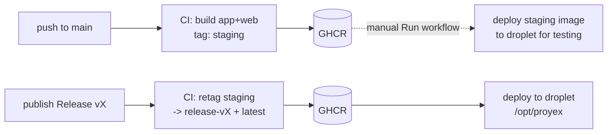

# Proyex Deployment

Proyex deploys as two Docker images — `app` (PHP-FPM + application code) and
`web` (nginx + compiled assets) — built once in CI, published to GHCR, and run
on a **single** DigitalOcean droplet that holds **only** the compose files and an
`.env`. There is no source code, no build, and no repo clone on the server.

## TL;DR (after one-time setup)

```bash
# BUILD — automatic on every push to main.
git push origin main
# -> CI builds `app` + `web` images tagged `staging` and pushes them to GHCR.
#    It does NOT deploy. main is validated as an image, not auto-shipped.

# TEST main ON THE SERVER — manual, on demand.
# GitHub -> Actions -> "Build and Deploy to Staging" -> Run workflow.
# -> Deploys the latest `staging` image to the droplet so you can test it.
#    NOTE: there is one droplet, so this temporarily replaces the running prod
#    stack. Restore prod by re-deploying the release (see Rollback).

# PRODUCTION — deliberate, when main looks good.
# Publish a GitHub Release (e.g. v1.2.0).
# -> CI PROMOTES the `staging` image to `release-v1.2.0` (+ `latest`) and deploys
#    to the droplet. No rebuild — the exact tested artifact ships.
```

## Architecture

One droplet, one running stack. Pushing to `main` only builds images; deploying
is always a deliberate action (a manual run to test, or a Release to ship).



- **Build / main lane** ([.github/workflows/build-and-deploy.yml](.github/workflows/build-and-deploy.yml)):
  every push to `main` builds and pushes both images tagged `staging`. The deploy
  job runs **only on manual `workflow_dispatch`** and targets the single droplet
  (`/opt/proyex`), temporarily replacing prod with the `staging` image for testing.
- **Production lane** ([.github/workflows/deploy-on-release.yml](.github/workflows/deploy-on-release.yml)):
  publishing a Release **re-tags the existing `staging` image by digest** to
  `release-<version>` and `latest` (via `docker buildx imagetools create` — no
  rebuild), then deploys to the droplet (`/opt/proyex`).
- **CI gates** on every PR/push: [tests.yml](.github/workflows/tests.yml),
  [lint.yml](.github/workflows/lint.yml), and [docker-build.yml](.github/workflows/docker-build.yml)
  (validates both images actually build before anything can be deployed).
- **Droplet**: holds only the compose files (copied by CI) and a local `.env`.
  Containers run by pulling pre-built images from GHCR.

> **Build once, promote.** Production never rebuilds from source. The `staging`
> image you tested is the identical image (same digest) that ships to prod when
> promoted. This is why rollback is just selecting an older `release-*` tag.

> **One droplet, one stack.** Testing `main` on the server replaces the running
> production stack for the duration of the test, because there is only one stack.
> Test locally first when you can (see README), and keep server testing brief.

## Why a single image build, two image targets

Both images are produced from one [docker/php/Dockerfile](docker/php/Dockerfile):

- A single `frontend_build` stage runs `npm run build`. The Laravel Wayfinder
  Vite plugin shells out to `php artisan`, so this stage has **both** PHP and Node.
- The `prod` target (app) and the `web` target (nginx) both `COPY --from` that
  one stage, so the compiled assets in `web` are identical to what `app` ships.
- The runtime images stay lean: no Node, npm, or Xdebug in `prod`/`web`.

The document root lives at the same absolute path (`/var/www/html/public`) in
both the `app` and `web` containers, so nginx's `SCRIPT_FILENAME` points at a
path php-fpm can open. See [docker/nginx/default.conf](docker/nginx/default.conf).

## Prerequisites

- A single DigitalOcean droplet, Ubuntu 24.04 LTS.
- A domain with a DNS A record pointing at the droplet IP (required for HTTPS;
  for a quick test you can launch on the raw IP over plain HTTP instead).
- GitHub repository with push access.
- An SSH key pair for CI deploys.

> **One droplet, one stack.** This setup runs a single production stack on one
> droplet. Pushing to `main` does not deploy; you deploy either by manually
> running the build workflow (to test `main` on the droplet, which temporarily
> replaces prod) or by publishing a Release (to ship). Both deploys target the
> same `/opt/proyex` stack and use the same `PROD_DEPLOY_*` secrets.

## One-time setup

### 1. Create a deploy SSH key

On your local machine:
```bash
ssh-keygen -t ed25519 -f ~/.ssh/proyex_deploy -C "github-actions-deploy" -N ""
ssh-copy-id -i ~/.ssh/proyex_deploy.pub root@YOUR_DROPLET_IP
```

### 2. Add GitHub Actions secrets

Repo → Settings → Secrets and variables → Actions. With a single droplet you only
need the `PROD_DEPLOY_*` set — both the manual `main` deploy and the release
deploy use it:

| Secret | Value |
|--------|-------|
| `PROD_DEPLOY_KEY` | Private SSH key for the droplet |
| `PROD_DEPLOY_HOST` | Droplet IP or hostname |
| `PROD_DEPLOY_USER` | SSH user (e.g. `root`) |

`GITHUB_TOKEN` (used to push/promote images in GHCR) is provided automatically.

### 3. Prepare the droplet

```bash
ssh root@YOUR_DROPLET_IP
apt update && apt upgrade -y
curl -fsSL https://get.docker.com | sh
```

Create the deploy directory (no repo clone — CI copies the compose files in on
every deploy; the app code ships inside the images):
```bash
mkdir -p /opt/proyex && cd /opt/proyex
```

#### If deploying with a non-root SSH user (recommended)

GitHub Actions can deploy as a non-root user (for example `proyexdeploy`), but
you must grant that user access to `/opt/proyex` and Docker first:

```bash
# run as root once
useradd -m -s /bin/bash proyexdeploy || true
mkdir -p /opt/proyex
chown -R proyexdeploy:proyexdeploy /opt/proyex
usermod -aG docker proyexdeploy
```

Then re-login as that user so the new group membership is active:
```bash
su - proyexdeploy
docker ps
```

> If this bootstrap is skipped, deploys often fail with permission errors when
> creating `/opt/proyex` or when running `docker compose` over SSH.

#### GHCR authentication (private packages only)

The images are currently public on GHCR, so `docker compose pull` works without
any login. If you ever make the GitHub repo (and therefore its packages) private,
the server won't be able to pull images until you authenticate:

1. Create a GitHub **Personal Access Token** (PAT) with `read:packages` scope:
   GitHub → Settings → Developer settings → Personal access tokens → Fine-grained
   or Classic → select `read:packages`.

2. Log in on the droplet (do this once; Docker caches the credentials in
   `~/.docker/config.json`):
   ```bash
   echo "YOUR_PAT" | docker login ghcr.io -u YOUR_GITHUB_USERNAME --password-stdin
   ```

3. Restrict the credential file so only the deploy user can read it:
   ```bash
   chmod 600 ~/.docker/config.json
   ```

> The PAT only needs `read:packages` — it cannot push or modify anything.
> Rotate it from GitHub if the droplet is ever compromised.

Create the `.env` (this file is the only thing you maintain by hand on the server).

> **Never copy your local dev `.env` to the server.** The dev file carries
> `APP_ENV=local`, `APP_DEBUG=true`, a dev `APP_KEY`, the dev `COMPOSE_FILE`, and
> weak/local DB credentials — all wrong or unsafe in production (`APP_DEBUG=true`
> alone leaks stack traces and env vars to visitors). Write a dedicated prod
> `.env` instead. You may start from [.env.example](.env.example), but it
> defaults to `DB_CONNECTION=sqlite`, so be sure to switch it to `mysql`.

```dotenv
APP_NAME=Proyex
APP_ENV=production
# Generate ONCE, locally (see "Generate APP_KEY" below). Never reuse the dev key.
APP_KEY=
APP_DEBUG=false
# Real domain once you have one; the droplet IP (http only) is fine for testing.
APP_URL=https://yourdomain.com

# Always target the production compose stack on this server, so plain
# `docker compose ...` (no -f flags) works for every command.
COMPOSE_FILE=docker-compose.yml:docker-compose.prod.yml

# Pin the deployed image. CI deploys a specific release-<version>; pinning here
# means a host reboot re-pulls the SAME version, not a moving `latest`.
IMAGE_TAG=release-v1.0.0

# Use the MySQL container — NOT sqlite. DB_HOST/REDIS_HOST are the compose
# service names (resolved on the internal Docker network), not 127.0.0.1.
DB_CONNECTION=mysql
DB_HOST=db
DB_PORT=3306
DB_DATABASE=proyex_prod
DB_USERNAME=proyex_prod
DB_PASSWORD=CHANGE_ME_strong
DB_ROOT_PASSWORD=CHANGE_ME_strong_root

REDIS_CLIENT=phpredis
REDIS_HOST=redis
REDIS_PASSWORD=null
REDIS_PORT=6379

SESSION_DRIVER=database
CACHE_STORE=database
QUEUE_CONNECTION=database
```

Lock the file down — it holds secrets and is read by the deploy user that runs
`docker compose`:
```bash
chmod 600 .env                       # -rw------- : owner read/write only
chown "$USER:$USER" .env             # owned by the deploy user (e.g. proyexdeploy)
```

> `docker compose` reads `.env` **as the user invoking it**, then injects the
> values into the containers — so `600` does not block MySQL/Redis/PHP from
> getting their variables. Avoid `644`/group/other read bits; they would expose
> your DB credentials to any other account on the box.

> The pinned `IMAGE_TAG` keeps prod on a fixed release across reboots. A manual
> `main` test deploy passes `IMAGE_TAG=staging` at deploy time (overriding this
> value for that run); restoring prod re-applies the pinned release tag.

#### Generate `APP_KEY`

Generate the key **locally** and paste the result into the server `.env`. Doing
it locally avoids a chicken-and-egg problem (the container may not boot without a
key). `--show` only prints the key; it does **not** modify your local `.env`:
```bash
# On your LOCAL machine, in the project folder:
php artisan key:generate --show      # prints: base64:...
```
No PHP locally? Produce an identical-format key with OpenSSL:
```bash
echo "base64:$(openssl rand -base64 32)"
```
Paste the `base64:...` value into `/opt/proyex/.env` as `APP_KEY=...`.

> **Generate it ONCE and keep it stable.** `APP_KEY` encrypts sessions, cookies,
> and `Crypt::` data. Changing it later logs everyone out and makes existing
> encrypted data unreadable. Each environment gets its own key — never reuse the
> dev key.

#### `APP_URL`: domain vs. raw IP

- **With a domain** (real production): `APP_URL=https://yourdomain.com`. Point a
  DNS A record at the droplet IP and terminate TLS (next step).
- **No domain yet** (testing only): `APP_URL=http://YOUR_DROPLET_IP`. A bare IP
  cannot get a trusted HTTPS certificate (Let's Encrypt issues for domains, not
  IPs), so this is plain HTTP — fine to verify the deploy, not for real traffic.
- Serve the app at the **root** of the host. Do **not** append a subdirectory
  like `/Proyex` to `APP_URL`; nginx serves from `/` and the Inertia/Vite assets
  use root-relative paths, so a prefix would break every asset and route.
- `APP_URL` is read at runtime. If config is cached, after changing it run
  `docker compose exec app php artisan config:clear`.

### 4. TLS termination (production)

The `web` container publishes plain HTTP on port `80`. Terminate TLS with a host
reverse proxy in front of it — do **not** point nginx at `/opt/proyex/public`
(there is no source on the server; the assets live inside the `web` container).

```bash
apt install nginx certbot python3-certbot-nginx -y
nano /etc/nginx/sites-available/proyex
```
```nginx
server {
    listen 80;
    server_name yourdomain.com www.yourdomain.com;
    return 301 https://$host$request_uri;
}

server {
    listen 443 ssl http2;
    server_name yourdomain.com www.yourdomain.com;

    ssl_certificate     /etc/letsencrypt/live/yourdomain.com/fullchain.pem;
    ssl_certificate_key /etc/letsencrypt/live/yourdomain.com/privkey.pem;
    ssl_protocols TLSv1.2 TLSv1.3;

    client_max_body_size 100M;

    # Proxy to the containerized web (nginx) service published on the host.
    location / {
        proxy_pass http://127.0.0.1:8080;
        proxy_set_header Host              $host;
        proxy_set_header X-Real-IP         $remote_addr;
        proxy_set_header X-Forwarded-For   $proxy_add_x_forwarded_for;
        proxy_set_header X-Forwarded-Proto $scheme;
    }
}
```

> The `web` container publishes on `127.0.0.1:8080` (loopback only, set in
> [docker-compose.prod.yml](docker-compose.prod.yml)) so it does **not** collide
> with this host nginx on port 80. The host proxy listens on `80`/`443` and
> forwards to `127.0.0.1:8080`. Use one TLS approach — this host proxy, **or**
> TLS inside the `web` container — not both.

```bash
ln -s /etc/nginx/sites-available/proyex /etc/nginx/sites-enabled/
nginx -t && systemctl restart nginx
certbot --nginx -d yourdomain.com -d www.yourdomain.com
```

#### No domain yet (IP-only temporary mode)

If you are launching on a raw IP first (no HTTPS yet), configure nginx to catch
all HTTP traffic and proxy to the containerized app. This avoids the default
"Welcome to nginx" page and serves your app at `http://YOUR_DROPLET_IP`:

```bash
sudo tee /etc/nginx/sites-available/proyex >/dev/null <<'EOF'
server {
  listen 80 default_server;
  listen [::]:80 default_server;
  server_name _;

  location / {
    proxy_pass http://127.0.0.1:8080;
    proxy_set_header Host $host;
    proxy_set_header X-Real-IP $remote_addr;
    proxy_set_header X-Forwarded-For $proxy_add_x_forwarded_for;
    proxy_set_header X-Forwarded-Proto $scheme;
  }
}
EOF

sudo ln -sfn /etc/nginx/sites-available/proyex /etc/nginx/sites-enabled/proyex
sudo rm -f /etc/nginx/sites-enabled/default
sudo nginx -t && sudo systemctl reload nginx
```

> Browsers may auto-upgrade to HTTPS and show `ERR_CONNECTION_REFUSED` on a raw
> IP because nothing listens on `443` yet. Test explicitly with
> `http://YOUR_DROPLET_IP` until a domain + TLS are configured.

### 5. First deploy

Trigger the staging lane (`git push origin main`) or the production lane (publish
a Release). To bring a server up manually the first time:
```bash
cd /opt/proyex
docker compose pull
docker compose up -d --wait      # waits for db/redis healthchecks
docker compose exec -T app php artisan migrate --force
docker compose exec -T app php artisan db:seed --force   # optional, first deploy only
```

### 6. Auto-start on reboot

```bash
nano /etc/systemd/system/proyex.service
```
```ini
[Unit]
Description=Proyex Docker Compose Application
Requires=docker.service
After=docker.service network-online.target
Wants=network-online.target

[Service]
Type=oneshot
WorkingDirectory=/opt/proyex
ExecStart=/usr/bin/docker compose up -d --wait
ExecStop=/usr/bin/docker compose down
RemainAfterExit=yes

[Install]
WantedBy=multi-user.target
```
```bash
systemctl daemon-reload && systemctl enable --now proyex
```

### 7. Firewall

```bash
ufw allow 22/tcp && ufw allow 80/tcp && ufw allow 443/tcp && ufw enable
```

If you use DigitalOcean Cloud Firewalls, allow the same inbound ports there
too. UFW and cloud firewalls are independent layers; either one can block
traffic even when the other is open.

### 8. Harden SSH (key-only access)

The droplet is public, so disable password login and rely only on keys. **Keep
your current SSH session open** while you do this and test from a second terminal,
so a mistake can't lock you out.

First confirm your key actually works (no password prompt):
```bash
# from your LOCAL machine, in a second terminal:
ssh -o PreferredAuthentications=publickey -o PasswordAuthentication=no DEPLOY_USER@YOUR_DROPLET_IP
```

> **`sshd` uses first-match-wins, not last.** `man sshd_config`: “for each
> keyword, the **first obtained value will be used**.” The drop-in files in
> `/etc/ssh/sshd_config.d/` are read in filename order, so a low-numbered file
> setting `PasswordAuthentication yes` (Ubuntu ships `50-cloud-init.conf` doing
> exactly that) **wins over** any higher-numbered file setting `no`. Adding
> another `no` later does nothing — you must make your `no` appear **first**.

Drop in a hardening file that sorts **before** `50-cloud-init.conf`:
```bash
sudo tee /etc/ssh/sshd_config.d/00-hardening.conf >/dev/null <<'EOF'
PasswordAuthentication no
KbdInteractiveAuthentication no
PermitRootLogin no
PubkeyAuthentication yes
EOF

sudo sshd -t && sudo systemctl restart ssh
```

Verify the **effective** value (this replays the first-match logic — trust it
over reading the files by eye):
```bash
sudo sshd -T | grep -i passwordauthentication   # must print: passwordauthentication no
```
Then confirm passwords are rejected (keep your other session open):
```bash
ssh -o PreferredAuthentications=password DEPLOY_USER@YOUR_DROPLET_IP   # -> Permission denied (publickey)
```

> Stop cloud-init from re-enabling passwords on reboot:
> ```bash
> grep -q '^ssh_pwauth:' /etc/cloud/cloud.cfg \
>   && sudo sed -i 's/^\(\s*ssh_pwauth:\).*/\1 false/' /etc/cloud/cloud.cfg \
>   || echo 'ssh_pwauth: false' | sudo tee -a /etc/cloud/cloud.cfg
> ```
> Optional extra hardening: `sudo passwd -l DEPLOY_USER` (lock the password) and
> install `fail2ban` to ban brute-force attempts on port 22.

## What each deploy does

Both lanes SSH to the server and run (the `db`/`redis` healthchecks gate this so
migrations never race a cold database):
```bash
docker compose pull
docker compose up -d --wait
docker compose exec -T app php artisan migrate --force
docker compose exec -T app php artisan cache:clear
docker compose exec -T app php artisan config:cache
```

Both workflows also support **manual runs** via `workflow_dispatch`
(Actions → select the workflow → Run workflow).

## Rolling back

Production images are immutable and versioned, so rollback is selecting an older
tag — never a `git checkout` on the server (there is no source there):
```bash
cd /opt/proyex
# set the desired previous release in .env (so reboots stay on it), then:
IMAGE_TAG=release-v1.0.0 docker compose pull
IMAGE_TAG=release-v1.0.0 docker compose up -d --wait
```
Update `IMAGE_TAG` in `/opt/proyex/.env` to make the rollback persistent.

## Database backups

```bash
nano /opt/proyex/backup-db.sh
```
```bash
#!/bin/bash
set -euo pipefail
cd /opt/proyex
# Credentials are read from .env — not hardcoded in this script.
set -a; source .env; set +a
BACKUP_DIR=/opt/proyex/backups
mkdir -p "$BACKUP_DIR"
FILE="$BACKUP_DIR/proyex_$(date +%Y%m%d_%H%M%S).sql.gz"
docker compose exec -T db mysqldump -u root -p"$DB_ROOT_PASSWORD" "$DB_DATABASE" | gzip > "$FILE"
find "$BACKUP_DIR" -type f -mtime +30 -delete
echo "Backup: $FILE"
```
```bash
chmod +x /opt/proyex/backup-db.sh
( crontab -l 2>/dev/null; echo "0 2 * * * /opt/proyex/backup-db.sh" ) | crontab -
```

## Monitoring & logs

```bash
docker compose ps
docker compose logs -f app
docker compose logs -f web
systemctl status proyex
```

## Troubleshooting

**A deploy failed in GitHub Actions** — open the Actions tab and read the failing
job. Common causes: wrong/empty deploy secrets, or the `docker build` gate
failing (fix the Dockerfile; it will block the deploy by design).

**Containers won't start / unhealthy**
```bash
docker compose ps
docker compose logs app
docker compose logs db
```

**MySQL `db` is unhealthy / `--wait` times out on first deploy** — almost always
a bad or missing `.env`. MySQL 8 refuses to initialize with a blank root
password, so if `DB_ROOT_PASSWORD`/`DB_PASSWORD` were empty (e.g. `.env` was
missing when the stack first came up), the container goes unhealthy. The failed
run also leaves a **half-initialized data volume** that must be wiped before a
retry — MySQL only reads the `MYSQL_*` env vars when it initializes an *empty*
data directory, so fixing `.env` alone is not enough:
```bash
cd /opt/proyex
docker compose down -v        # removes the bad proyex-mysql-data volume
# fix /opt/proyex/.env (real DB_DATABASE/DB_USERNAME/DB_PASSWORD/DB_ROOT_PASSWORD)
docker compose up -d --wait
```
> `down -v` deletes the database volume. Only do this on a fresh/first deploy
> with no real data, or restore from a backup afterward (see Database backups).

**White screen / assets 404** — confirm the `web` image is the matching version
(same tag as `app`) and that `SCRIPT_FILENAME` in
[docker/nginx/default.conf](docker/nginx/default.conf) points at
`/var/www/html/public`.

**Database connection** 
```bash
docker compose exec app php artisan tinker
>>> DB::connection()->getPdo();
```
